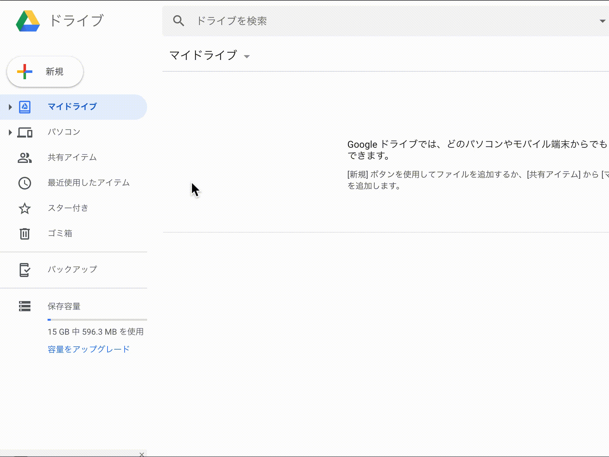
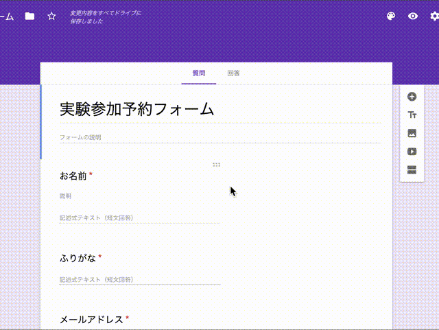
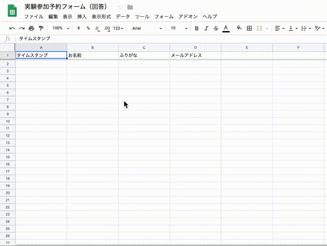
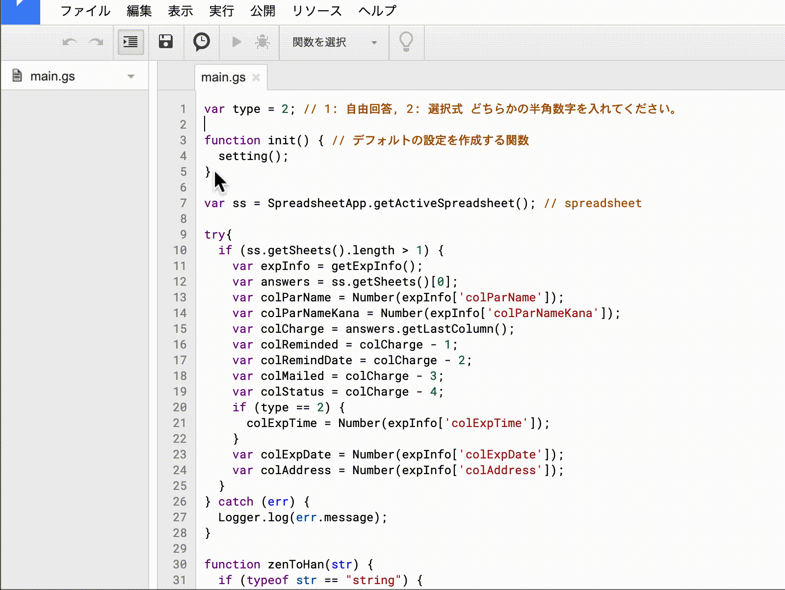
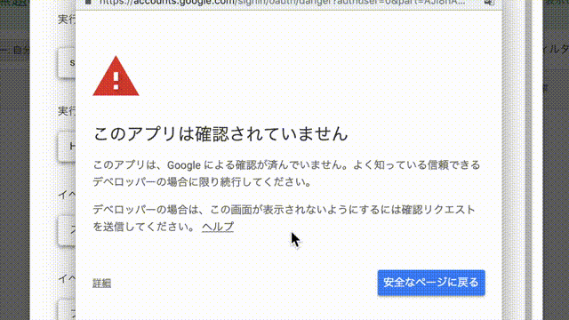

# participants-recruitment-jp

An easy way of recruiting participants.

- [導入](#導入)
- [運用](#運用)
- [詳細な設定](#詳細な設定)
    - [メール](#メール)
    - [メンバー](#メンバー)

本ハックは、中規模までの心理学実験を行う際に、参加者の募集・連絡を円滑に行うものです。
Google Apps Script (エクセルVBAのようなもの)を用いて、Googleの各種サービス (googleサイト、googleフォーム、googleカレンダー及びgmail) を連携させることで、ほぼ自動で参加者の募集・連絡を行うことができます。
<!-- 心理学実験以外にも参加者の募集・連絡に用いることもできます。 -->

なお、her0m31さんの「[Google Form -> SpreadSheet -> Calendar && Mailで簡単な予約フォームを作る。](
http://qiita.com/her0m31/items/0a67d52179341380dd31)」
のご説明・コードを大変参考にさせていただきました。

### 何ができるのか？

1. 参加者は、空き時間を確認し、空いている時間帯に心理学実験の仮予約をすることができます。
    - 実験実施可能時間を設定して、その時間外に予約してきた場合は応募者に再登録を促すメールが**自動で**送信されます。
    - 既に存在する予約や予定と重複する時間に予約してきた場合も同様のメールが送信されます。

2. 実験者は、仮予約された時間帯をスプレッドシート上で確認し、予約完了を`111`と入力することで行うことができます。
    - これに連動して、参加者には実験日時など必要な情報が記載されたメールが**自動で**送信されます。
    - `111`と入力する代わりに、`222` (既参加), `333` (定員超過)のいずれかを入力すると、それぞれに対応するメールを**自動で**送信し、参加を断ることができます。

3. 実験の前日に参加者にリマインダーメールが**自動で**送信されます。
4. 実験者が複数いるケースにも対応しています。
5. これらの機能に関する設定 (メールの本文など) をスプレッドシート上で変更することが可能です。
    - ノンプログラマーの方々でも用途に合わせて柔軟に変更できるようにしました。

### 何ができないのか？

1. 同じ時間帯に複数人の予約を入れることはできません。したがって、1回の実験に2人以上が参加するという実験には対応していません。

## Change Log 

### 2019/05/31

- 日付に合わせてフォームの希望日の選択を更新する関数の重大なバグを修正しました

### 2019/05/28

- 複数のトリガーを予約完了のトリガーとして指定できるようになりました。
- 選択式 `TYPE = 2` の場合に，日付にあわせてフォームの希望日の選択肢が更新されるようになりました。

# 導入

`main.gs`を利用した参加者募集システムを導入します。手順は以下のようになります。

1. 参加募集フォームの作成
2. フォームの回答が記録されるスプレッドシートの作成
3. スプレッドシートに対して`main.gs`を実行できるプロジェクトの作成
4. カレンダーの設定
5. 参加者がアクセスするサイトの作成

## 0. googleアカウントを予め取っておいて下さい

**本コードで使用するメールアドレスはGmailのものとします**。そのため、Googleアカウントを持っていない場合は作成してください。なお、実験専用のGoogleアカウントの作成をおすすめします。プライベートでも使用しているアカウントでこのシステムを利用すると、本ハックがうまく動作しなかったり、普段のカレンダーの利用が不便になったりする可能性があります。

## 1. 参加募集フォームの作成

googleフォームを利用して質問フォームを作成します。

1. 利用するGoogleアカウントのgoogleドライブを開く
2. Googleドライブの左上にある「＋」ボタンをクリックし、「フォーム」を選択し、新規フォームを作成する
3. 必要な質問項目を作成します。



### 質問項目の設定について
本ハックでは、希望時間の聞き取りに関して次の2種類の方法に対応しています。

1. **自由回答タイプ**: 参加者に任意の希望日時を入力してもらいます。少なくとも以下の3つを質問項目として設定してください。
    - 名前 (短文回答)
    - メールアドレス (短文回答)
    - 希望日時 (日付, 右下の設定ボタンをクリックして時刻を含めるにチェック)

2. **選択式タイプ**: 参加者は事前に用意された実験の実施日・時間の選択肢から都合に合うものを選択します。少なくとも以下の4つを質問項目として設定してください。
    - 名前 (短文回答)
    - メールアドレス (短文回答)
    - 希望日 (ボタン選択 or プルダウン選択)
        - 日付表示のフォーマットは問いません (2019/5/23, 5月23日)
        - 年を含む場合は西暦を使用してください。
        - 実施月が募集月と同じでない限り**日にちだけの選択肢は用いないでください**。
    - 希望時間 (ボタン選択 or プルダウン選択)
        - 選択肢には実験終了時間も含めることをおすすめします (12:30 - 13:30など)
        - 時間表示のフォーマットは問いません (12:30, 12時30分)

**自由回答**の場合、実験者が事前に選択肢を設定する必要はなく、参加者も自身の予定に合わせて自由に実験日時を指定することができます。
ただし、たまに中途半端な実験間隔が生じることがあります。
例えば、1時間の実験3つがそれぞれ13:00-14:00, 14:45 - 15:45, 16:00 - 17:00に予約が入るような場合、「2つ目の予約が15:00 - 16:00ならば14:00-15:00に別の実験予約が入ったかもしれないのに、、、」という気持ちになります。

**選択式**の場合、実験者は事前に選択肢を設定する必要があり、参加者もその時間にしか応募することしかできませんが、実験時間のスロットを固定することができます。
そのため、先述のような事態を回避することができます。
比較的長い実験を1日のうちに詰めて実施したい場合は、選択式のほうが確実かと思います。

必要に応じて質問項目を増やすことができます。例えば、

- ふりがな (短文回答)
- 年齢 (短文回答, 回答の検証 -> 「数字」とすると半角数字だけが受け付けられるようになる)
- 性別 (ボタン選択 or プルダウン選択)
- 所属 (短文回答 or プルダウン選択[こっちは表記ゆれがなくていい])
- 学年 (短文回答 or プルダウン選択[こっちは表記ゆれがなくていい])

ただし、**希望日時** (自由回答) あるいは**希望日・希望時間** (選択式) はフォームの最後に持ってくることを推奨します。
後述の初期設定のままシステムを利用することができます。

なお、本ハックは**実験参加の希望日時を複数尋ねることには対応していません。**
希望日時複数聞き、なるべく多くの実験を短期間に詰めて実施できるよう調整することも可能ではありますが、あれこれ悩むコストの割に得られる効果は薄いと考えています。
利用して単一の希望日時を聞き先着順に予定を組んでいった場合でも、相応に実験を詰めて実施できると思います。

### 質問項目の設定に関するTips

- それぞれの質問項目には、設定ボタンから「説明」をクリックすると説明文を加えることができます。注意事項等を記載すると良いと思います。
- **それぞれの回答を必須の回答にしておくことも忘れないで下さい。**
- フォームの実用例として、[https://sites.google.com/view/participant-recruit-test/home/free](https://sites.google.com/view/participant-recruit-test/home/free) あるいは [https://sites.google.com/view/participant-recruit-test/home/free](https://sites.google.com/view/participant-recruit-test/home/choice) をご覧ください。

## 2. フォームの回答が記録されるスプレッドシートの作成

フォームで得られたデータをスプレッドシートに送るように設定します。
作業は以下の1手順のみになります。

回答タブから右上に表示されるスプレッドシートの作成をクリックし、スプレッドシートを作成します。

以降、フォームに入力されたデータはスプレッドシートに反映されるようになります。



## 3. スプレッドシートに対して`main.gs`を実行できるプロジェクトの作成

アンケートの回答があったときや、参加の予約を完了させるときにほぼ自動でメールが送信されるように、スプレッドシートに対して動作するプログラムを導入します。

1. main.gsのコードをコピーして下さい。
    - [ここ](https://raw.githubusercontent.com/SNishiyama/participants-recruitment-jp/master/main.gs)にアクセスして`crtl-A`および`ctrl-C`（Macなら`command-A`, `command-C`）
2. 質問フォームの回答が記録されるスプレッドシートを開き、上部のツールバーから`ツール`->`スクリプトエディタ`の順にクリックして下さい。
3. スクリプトエディタが開かれますので、ここに`main.gs`の内容を貼り付けます。
    - `ctrl-S`（Macなら`command-S`）で保存してください。このとき，プロジェクトの名前を求められるので，適当に決めてください。



## 4. 参加者が応募の際に空き時間を参照するgoogleカレンダーの共有設定

googleカレンダーのページに飛んでください。
ページ左側にカレンダー一覧がありますが、今回はマイカレンダーの一番上にあるカレンダーを使用します。

- このカレンダーの右に現れる縦向きの3つの点をクリックし、「設定と共有」を選択して下さい。
- アクセス権限の「一般公開して誰でも利用できるようにする」にチェックを入れてください
- さらに、**必ず右側の「閲覧権限 (すべての予定の詳細) 」をクリックし、予定の時間枠のみを一般に公開 (詳細は非表示」に変更してください。**

### 注意
**イベント名に参加者の名前が入るので個人情報を表示しないために、必ず予定の時間枠のみを一般に公開にはチェックを入れて下さい。**

## 5. google sitesで参加者を募集するためのページを作成して下さい

参加者が実験 (者) の予定を参照しながら応募できるように、カレンダーと応募フォームを配置したgoogle siteを作ります。
完成例として、https://sites.google.com/site/ishiguroshinri/ あるいは https://sites.google.com/site/snishiyamaexperiment/ をご覧ください。

Google ドライブにアクセスし、フォームを作成したときと同様に、左上の新規 -> その他 -> Google サイトの順にクリックしてください。

- 実験の概要を記載するためのテキストボックス
- 参加者の情報及び希望日時を入力してもらう質問フォーム
- 空き時間を参照するためのカレンダー

を配置します。

すべて右側にあるツールバー「挿入」タブから選択します。

- 質問フォームは「ドライブ ->  (フォームを保存したフォルダ ->) 該当するフォーム」で挿入できます。
- カレンダーは「挿入」タブを下の方までスクロールすると「カレンダー」がという項目があるので、それをクリックし、gmailのアドレスが表示されているものを選択してください。


## 以上で導入は終了です

[先頭に戻る](#participants-recruitment-jp)

# 運用

## プログラムの初期設定を行う

先ほど開いたスクリプトエディタから`init`という関数を実行し、プログラム動作や送信されるメール内容などの初期設定を行います。

1. **スクリプトの一番最初の行にある`type`を応募フォームの形式に合わせて変更してください**。
1. 実行ボタン (▶) の右にある`関数を選択`から`init`を選択
1. 実行ボタン (▶) をクリック



関数を選択できない場合は，スクリプトが保存されていないことが原因かもしれません。
`ctrl-S`（Macなら`command-S`）で保存してください。このとき，プロジェクトの名前を求められるので，適当に決めてください。

その直後スプレッドシートを開くと、「初期設定を行います」というウィンドウが表示されます。
説明を読み問題なければ初期設定を行ってください。スプレッドシートに「設定」「テンプレート」「メンバー」というシートが新たに追加されます。

**このとき、Googleからセキュリティに関する警告ウィンドウが開きます。**
以下の手順でプログラムを承認してください。

- 詳細を表示をクリック
- 画面をスクロールしてウィンドウ下部にある`安全でないページに移動`をクリック
- 画面をスクロールしてウィンドウ下部にある`許可`をクリック



## 「設定」シートの太枠内の情報は必ず変更してください。

## カレンダーの事前準備

実験実施可能時間内で、実験ができない時間があれば、使用するgoogleアカウントのカレンダーにそれを追加してください。

## 動作確認

実際の実験募集に利用する前に動作確認を行ってください。

### 一度、参加者役になって仮予約をして下さい

サイトにアクセスし、フォームから実験参加の応募を行ってください。
なお、以下の点をおすすめします。

- シークレット (プライベート) ウィンドウからサイトにアクセスする。
- 実験用のメールアドレスではないアドレスをフォームに記入する。

ともに参加者が利用する状況に近づけるためです。
シークレットウィンドウからサイトにアクセスした場合は、カレンダーの予定が「予定あり」とだけ表示されているかどうかを確認してください。

仮予約ができましたら、まず、確認のメールが参加者と自分に送信されます。

次にスプレッドシート上に回答が記録されます。例えば、

| タイムスタンプ | お名前 | メールアドレス | 希望日時 | 予約ステータス | 連絡したか | リマインド日時 | リマインドしたか | 担当 |
|---:|:---|:---|---:|---:|---:|---:|---:|---:|
| 2017/04/05 12:30:35 | 参加者太郎 | pro.sankasha@sample.com | 2017/04/09 16:00:00 |  |  |  |  |  |

という形になります。

また、カレンダーには、「仮予約：参加者名」というイベントが希望日時 (+所要時間) の幅で生成されているはずです。

#### 他にも

以下の場合に応募の修正を促すメールが送信されるかどうかを確認してください。

- 設定された実験実施可能時間 (デフォルトでは9~19時) よりも早くor遅くに予約があった場合
- 予定の重複があった場合

### 予約を完了させます

実験者が実験可能で他の参加者が当該実験にすでに参加したことがないかなどを確認してください。
既参加かどうかは`ctrl+f`の検索機能を用いることでチェックできると思います。
問題なければ、スプレッドシート「フォームの回答1」シートにある「予約ステータス」の列に`111`を入力してください。
予約完了メールが送信されるはずです。
また、カレンダーの予定が「予約完了：参加者名」に変わっているはずです。
質問項目に「ふりがな」を設けていれば「予約完了：参加者名 (ふりがな) 」とカレンダーに表示されます。

#### 他にも

予約ステータスに`222`(既参加)や`333`(定員超過)を入力し、参加を断るメールが送信されるかどうかを確認してください。
参加を断るキーを入力した場合、カレンダーに記載された仮予約の予定は削除されます。

### リマインダーが自動で送信されるはずです。

`リマインド日時`の列に記載された日の19時~20時 (デフォルトの場合) にリマインドメールが送信されるかどうかを確認してください。

## 以上が基本的な運用方法になります。

[先頭に戻る](#participants-recruitment-jp)

# 詳細な設定

## メール

適切に動作することが確認されたら、ご自身の用途や好みに合わせてメールの題名・本文を編集してください。

スプレッドシートの「テンプレート」シートの題名・本文 (平日 or 土日) の列を編集することによって送信されるメールの題名・本文を編集することができます。

メールの本文中に記載されているアルファベットの文字列 (`experimenterName`, `experimenterMailAddress`) は「設定」シートの「メール本文内でのキー」列の文字列と一致しています。
`main.gs`は、「設定」シートでキーとして設定されている文字列 (例えば`experimenterName`) をメールの本文中から探し、その場所に対応する情報 (デフォルトでは実験太郎) が本文に埋め込まれるようになっています。
したがって、必要に応じて「設定」シートの情報をメールに記載しないようにしたり、「設定」シートに新しく情報を追加しそれをメールに記載させるようにすることができます。

## 変更例

予約完了の際に送信するメール (トリガー`111`の行) では電話番号がメールに記載されますが、それを記載されないように変更します。
デフォルトの本文は以下のとおりです。

```
participantName 様

この度は心理学実験への応募ありがとうございました。
expDatefromWhen〜toWhenの心理学実験の予約が完了しましたのでメールいたします。
場所はexperimentRoomです。当日は直接お越しください。
ご不明な点などありましたら、experimenterMailAddressまでご連絡ください。
当日もよろしくお願いいたします。

実験責任者experimenterName (当日は他の者が実験担当する可能性があります)
当日の連絡はexperimenterPhoneまでお願いいたします。
```

この最後の1文を削除すれば電話番号は表示されなくなります (「設定」シートから電話番号の情報を削除する必要はありません) 。

同時に、本文に実験者の所属を記載したい場合は、まず「設定」シートの新しい行に例えば

| 1列目 | 2列目 | 3列目 |
|---:|---:|---:|
| 実験者の所属 | experimenterAff | 心理学大学実験研究科 |

と作成したあと、メールの本文の最後の1文を

```
実験責任者 experimenterAff experimenterName (当日は他の者が実験担当する可能性があります) 。
```

と変更することで、メールに設定した所属を記載させることができます。


### 注意点

メールの本文を編集する際、**以下の点に注意してください。**

- 「設定」シートに既に存在するキーは**絶対に変更しないでください**。うまく動作しなくなります。
- 「設定」シートに登場しないキー (`participantName`, `expDate`, `fromWhen`, `toWhen`) はプログラム内でこっそり使われています。
- メールのキーに使用する文字列は**必ずアルファベットを使用してください**。
プログラムがメール本文に記載されているキーを確実に検出するためです。
- メールのキーに使用する文字列はある程度長くすることをおすすめします。
理由は直前の項目と同じです。
極端な例として、キーとして`a`を使用すると、その情報が、p`a`rticip`a`ntN`a`me, expD`a`teなど、テンプレート中のあらゆる`a`や`A`にその情報が埋め込まれてしまいます。

### 補足

一番左の列「トリガー」とは予約ステータスに入力する値のことです。
この値と同じ行にある題名・本文がメールに使用されます。

必要に応じて、新たにテンプレートを追加することができます。

例えば、以下の2行分を追加したとすると

| トリガー | 土日での変更 | 題名 | 本文  |
|---:|---:|:---|:---|
| 444 | 0 | 緊急 | 緊急事態です |
| 柴犬 | 0 | 柴犬 | 可愛いですよね |

「フォームの回答」の予約ステータスにそれぞれのトリガーを入力すればそれぞれの題名・本文で該当する参加希望者にメールを送ることが可能です。
ただし，**予約完了のトリガーとして使用されるものについては必ず半角数字列にしてください**

「土日での変更」列では，**実験実施日**が平日の場合と土日の場合とで送信されるメールの本文内容を変更するかどうかを決めることができます。
変更する場合は`1`を，しない場合は`0`を入力してください。
この列に`1`が入力されている場合は「本文（土日）」の列にメールの内容を記入してください。
なお，残念ながら祝日には対応していません。

## メンバー

本ハックでは、実験責任者 (実験アカウント所有者) 以外にも実験を担当する人がいるという用途にも対応しています。
具体的には、各参加者に送る予約完了およびリマインダーのメールを事前に設定した人物に送信することができます。

1. 「メンバー」シートに分担者の名前、アドレスを記入してください。
2. 「キー」列に番号をふってください。
特に理由がない限り1から順で問題ありません。
3. 予約を完了させる前に、「担当」列に担当者の番号を入力してください。
複数人いる場合は`,`で区切って入力してください (`1,3`など) 。
4. 入力後予約を完了させれば実験の担当者にもメールが送られます。
5. そのまま放っておけば、リマインダーもその番号の人に送信されます。
  - 言い換えれば、担当者が変更になったりした場合は「担当」の列を変更すればリマインダーから新しい担当者に送信することができます。

担当回数列を作成したので、必要があれば利用してください。
デフォルトで関数が入力されていますが、**担当の列に`1,3`などと複数人が指定されている場合、この関数は機能しません**

[先頭に戻る](#participants-recruitment-jp)

# 免責事項
作成者は、本ハックを利用することにより生じる一切の損害、損失の責任を負いません。

# ライセンス
2条項BSDライセンスとします。
